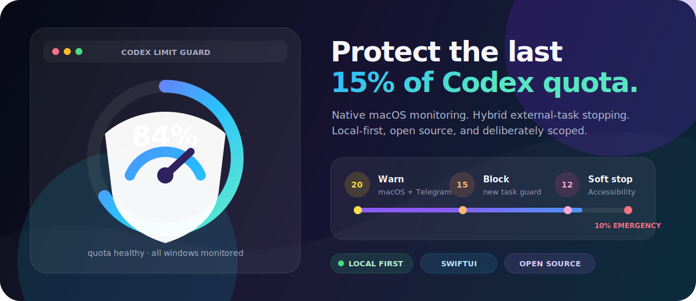
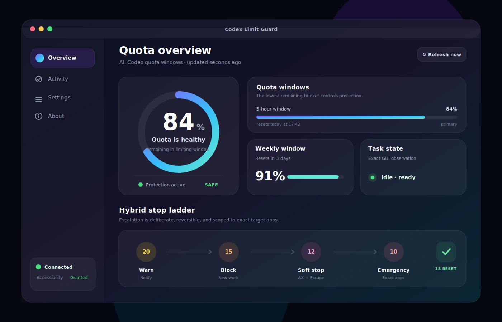
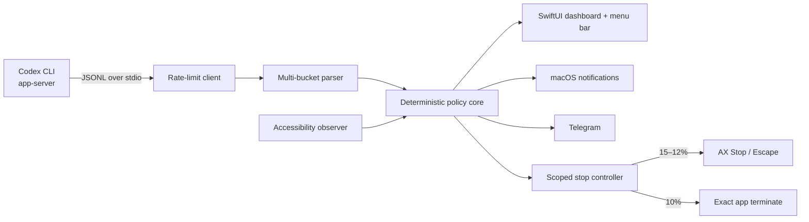

<div align="center">
  

  # Codex Limit Guard

  **A native, local-first macOS guard for OpenAI Codex quota limits.**

  Monitor every reported quota window, get early warnings, block new work near the limit, softly stop active GUI tasks through Accessibility, and keep a tightly scoped emergency fallback.

  [](https://github.com/mishkacher/Codex-Limit-Guard/actions/workflows/ci.yml)
  [](https://github.com/mishkacher/Codex-Limit-Guard/releases)
  [](https://www.apple.com/macos/)
  [](https://www.swift.org/)
  [](LICENSE)
</div>

> [!IMPORTANT]
> Codex Limit Guard is an independent open-source utility. It is not an official OpenAI product and is not affiliated with or endorsed by OpenAI.

## Why this exists

Long Codex tasks can continue consuming quota after you stop watching the screen. Codex Limit Guard runs independently from your normal Codex workflow and gives you a configurable safety ladder without forcing you to launch Codex through a wrapper.

<div align="center">
  
</div>

## Protection ladder

| Remaining | Default action | What happens |
|---:|---|---|
| **20%** | Warn | macOS notification and optional Telegram message |
| **15%** | Block new work | One task already active at the boundary may finish; then idle target apps are closed |
| **12%** | Soft stop | Find an exact Stop/Cancel/Interrupt control via macOS Accessibility, then fall back to Escape |
| **10%** | Emergency stop | Graceful terminate, followed by force-terminate only for exact Codex/ChatGPT app identities |
| **18%** | Recover | Release the new-task block while preserving the 20% warning hysteresis |

Every threshold is configurable. The policy is implemented in a platform-independent Swift core and covered by deterministic unit tests.

## Highlights

- **Native SwiftUI dashboard** with a polished status ring, quota cards, activity history, settings, and a menu-bar companion.
- **Official Codex App Server transport** over local `stdio`; no browser scraping and no screen OCR.
- **Multi-bucket monitoring** across primary, secondary, short-window, weekly, and future limit buckets returned by Codex.
- **Hybrid external-task control** designed for users who run Codex normally rather than through the guard.
- **Fail-safe Accessibility behavior**: the app does not infer an idle task or close a GUI target when Accessibility trust is missing.
- **Exact process targeting** by known bundle identifiers or exact app bundle paths; no broad `killall` patterns.
- **Secret-safe notifications** with Telegram credentials stored in macOS Keychain.
- **Local redacted JSONL event log** with no analytics or telemetry.
- **Launch at login**, reconnection backoff, stale-snapshot protection, and action throttling.
- **Public-project hygiene**: CI, release automation, threat model, security policy, contribution guide, issue templates, and a documented 20-pass audit.

## Architecture



The separate App Server connection is used for quota telemetry. It cannot directly interrupt a turn owned by a different Codex App Server connection, so GUI Accessibility is intentionally isolated behind a narrow adapter. See [Architecture](docs/ARCHITECTURE.md) and [Threat model](docs/THREAT-MODEL.md).

## Requirements

- macOS 13 Ventura or newer
- Apple Silicon or Intel Mac
- Codex CLI installed and signed in
- macOS Accessibility permission for soft-stop and idle-state inspection
- Optional: Telegram bot token and chat ID

## Install a release

1. Download the latest `Codex-Limit-Guard-macOS.zip` from [Releases](https://github.com/mishkacher/Codex-Limit-Guard/releases).
2. Move **Codex Limit Guard.app** to `/Applications`.
3. On the first unsigned community build, Control-click the app and choose **Open**.
4. Open **System Settings → Privacy & Security → Accessibility** and enable Codex Limit Guard.
5. Confirm the live quota cards, then configure Telegram and launch-at-login as needed.

> [!WARNING]
> Current community builds are ad-hoc signed and not Apple-notarized. Review the source and checksum before opening a release artifact.

## Build from source

```bash
git clone https://github.com/mishkacher/Codex-Limit-Guard.git
cd Codex-Limit-Guard
swift test
./scripts/build-app.sh
open "dist/Codex Limit Guard.app"
```

Install the locally built app:

```bash
./scripts/install-local.sh
```

## Telegram setup

1. Create a bot with `@BotFather`.
2. Send the bot a message and obtain your numeric chat ID.
3. Open **Settings → Telegram**.
4. Save the token to Keychain, enter the chat ID, enable Telegram, and send a test.

The token is never written to `UserDefaults`, project files, or the event log.

## Safety model and limitations

- The 15% new-task block is **best effort**, not atomic: a user can begin a task between UI observations.
- Soft-stop depends on the current Accessibility tree exposed by Codex/ChatGPT. UI changes can require selector updates.
- The guard refuses 15–12% close/soft-stop actions without Accessibility permission. The exact-app emergency stop can still operate at 10% when enabled.
- A stale quota snapshot never triggers a new stop action.
- The tool observes quota metadata and task-control UI elements; it does not proxy prompts or store OpenAI credentials.
- Always keep unsaved work committed. Emergency termination can interrupt local edits in the target app.

## Quality gates

```bash
./scripts/audit.sh
./scripts/run-20-round-audit.sh
```

The repository records twenty focused review passes covering requirements, architecture, parser resilience, threshold boundaries, hysteresis, external-task safety, process targeting, secrets, logs, packaging, CI, and final regression. Read the [audit log](docs/AUDIT-LOG.md).

## Contributing

Issues and pull requests are welcome. Please read [CONTRIBUTING.md](CONTRIBUTING.md), [SECURITY.md](SECURITY.md), and the [Code of Conduct](CODE_OF_CONDUCT.md) before participating.

## License

MIT — see [LICENSE](LICENSE).
